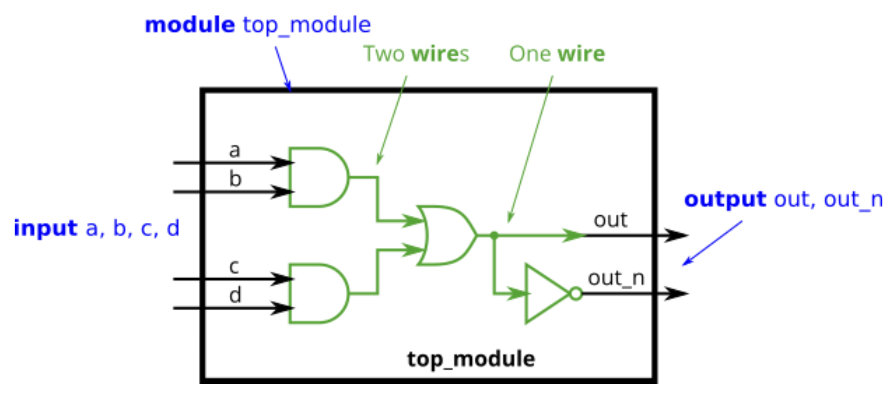

Implement the following circuit. Create two intermediate wires (named anything you want) to connect the AND and OR gates together. Note that the wire that feeds the NOT gate is really wire out, so you do not necessarily need to declare a third wire here. Notice how wires are driven by exactly one source (output of a gate), but can feed multiple inputs.

If you're following the circuit structure in the diagram, you should end up with four assign statements, as there are four signals that need a value assigned.

