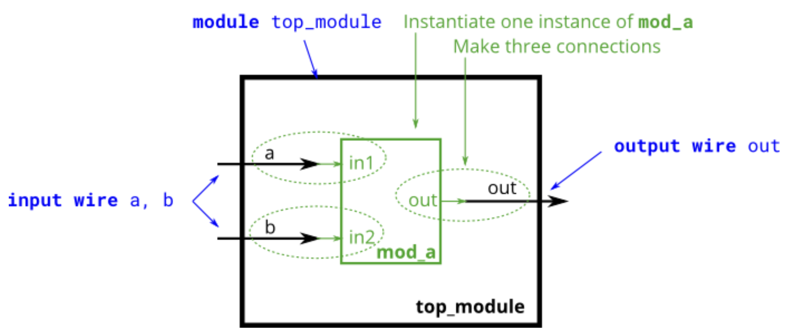

The figure below shows a very simple circuit with a sub-module. In this exercise, create one instance of module mod_a, then connect the module's three pins (in1, in2, and out) to your top-level module's three ports (wires a, b, and out). The module mod_a is provided for you — you must instantiate it.

When connecting modules, only the ports on the module are important. You do not need to know the code inside the module.

The hierarchy of modules is created by instantiating one module inside another, as long as all of the modules used belong to the same project (so the compiler knows where to find the module). The code for one module is not written inside another module's body (Code for different modules are not nested).

You may connect signals to the module by port name or port position.

# 1. By Position
The syntax to connect wires to ports by position should be familiar, as it uses a C-like syntax. When instantiating a module, ports are connected left to right according to the module's declaration. 

For example: mod_a instance1 ( wa, wb, wc );

This instantiates a module of type mod_a and gives it an instance name of "instance1", then connects signal wa (outside the new module) to the first port (in1) of the new module, wb to the second port (in2), and wc to the third port (out). One drawback of this syntax is that if the module's port list changes, all instantiations of the module will also need to be found and changed to match the new module.

# 2. By Name
Connecting signals to a module's ports by name allows wires to remain correctly connected even if the port list changes.

For example: mod_a instance2 ( .out(wc), .in1(wa), .in2(wb) );

The above line instantiates a module of type mod_a named "instance2", then connects signal wa (outside the module) to the port named in1, wb to the port named in2, and wc to the port named out. Notice how the ordering of ports is irrelevant here because the connection will be made to the correct name, regardless of its position in the sub-module's port list. Also notice the period immediately preceding the port name in this syntax.
