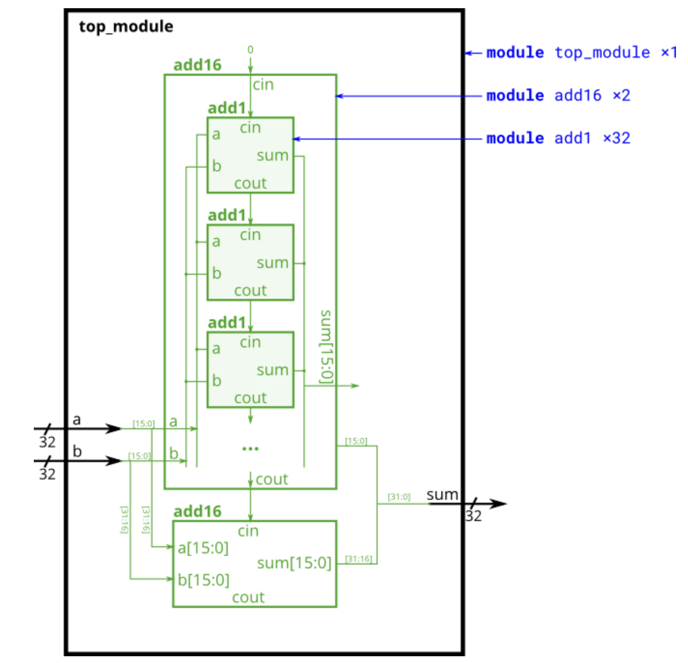

In this exercise, you will create a circuit with two levels of hierarchy. Your top_module will instantiate two copies of add16 (provided), each of which will instantiate 16 copies of add1 (which you must write). Thus, you must write two modules: top_module and add1.
you are given a module add16 that performs a 16-bit addition. You must instantiate two of them to create a 32-bit adder. One add16 module computes the lower 16 bits of the addition result, while the second add16 module computes the upper 16 bits of the result. Your 32-bit adder does not need to handle carry-in (assume 0) or carry-out (ignored).
Connect the add16 modules together as shown in the diagram below. The provided module add16 has the following declaration:

module add16 ( input[15:0] a, input[15:0] b, input cin, output[15:0] sum, output cout );

Within each add16, 16 full adders (module add1, not provided) are instantiated to actually perform the addition. You must write the full adder module that has the following declaration:

module add1 ( input a, input b, input cin, output sum, output cout );

Recall that a full adder computes the sum and carry-out of a+b+cin.

In summary, there are three modules in this design:

top_module — Your top-level module that contains two of...

add16, provided — A 16-bit adder module that is composed of 16 of...

add1 — A 1-bit full adder module.

