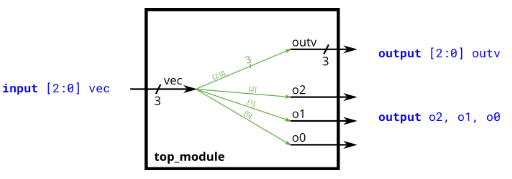

Build a circuit that has one 3-bit input, then outputs the same vector, and also splits it into three separate 1-bit outputs. Connect output o0 to the input vector's position 0, o1 to position 1, etc.

In a diagram, a tick mark with a number next to it indicates the width of the vector (or "bus"), rather than drawing a separate line for each bit in the vector.

